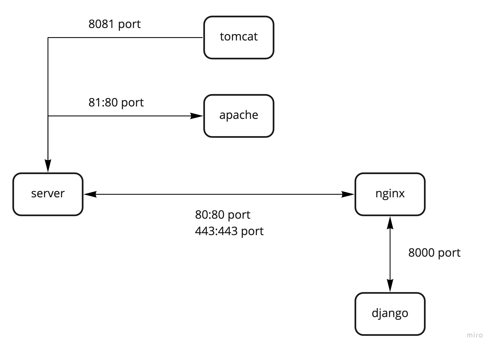

# 仿生水膠網站架設與介紹
## 網站導覽
仿生水膠網站可分為前端、後端與連接前後端部分，前端代表的是網頁呈現部分，使用者可以透過直覺化點擊來查看資料庫內的表格以及上傳資料進入資料庫等操作，後端代表SQL資料庫，可以使用SQL語言提取資料庫，並且格式化表格的型態，規定往後上傳的資料表格格式，連接前後端的語言為python3的django package，內建有連線至第三方資料庫的功能，以上皆是使用Docker服務架設的虛擬環境操作，每一個軟體有專屬的容器，以維持軟體間版本獨立與資訊安全等維護問題。
## 域名對應端口設置(反向代理)

## 資料庫容器環境

- **nginx:** 處理靜態資源，動態請求會傳給uwsgi處理。
- **web(Django+uWSGI):** 處理動態請求。
- **Redis:** 負責緩存服務。
- **MariaDB:** 負責數據存儲。
> Django container depends on MariaDB container and Redis, and nginx container depends on Django container.

## Nginx反向代理

