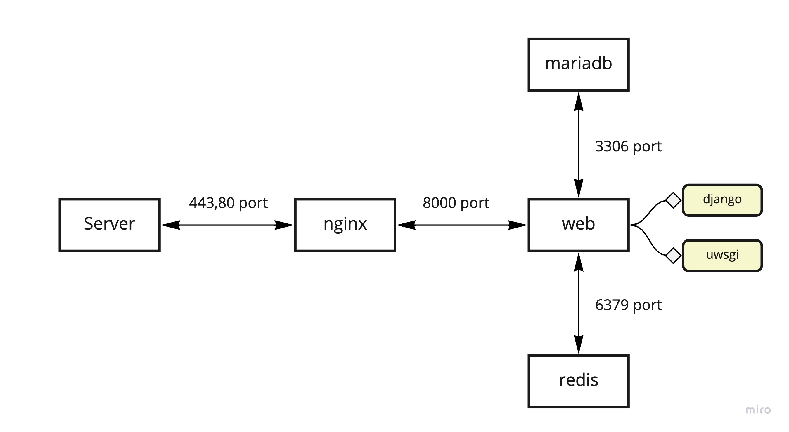
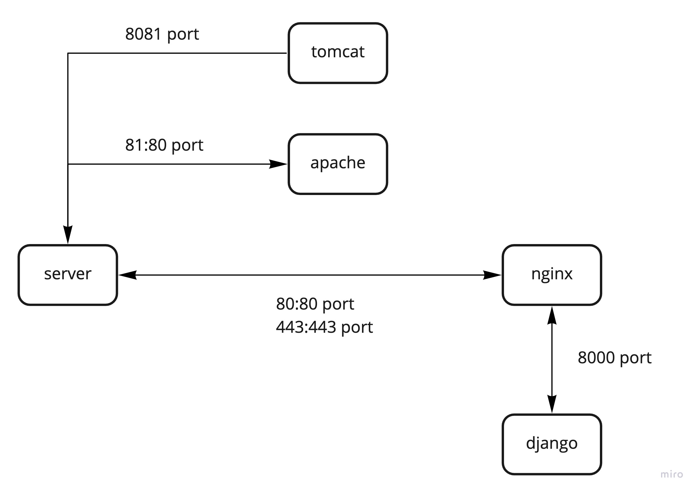

# 仿生水膠網站架設資訊

## 資料庫容器環境

- **nginx:** 處理靜態資源，動態請求會傳給uwsgi處理。
- **web(Django+uWSGI):** 處理動態請求。
- **Redis:** 負責緩存服務。
- **MariaDB:** 負責數據存儲。
> Django container depends on MariaDB container and Redis, and nginx container depends on Django container.

### 容器資訊
| 容器名稱 | 映像檔 | 備註 |
| --- | --- | --- |
| geldb_web | debby940406/gel_database_web | 進入容器後執行`./start.sh` |
| geldb_nginx | debby940406/gel_database_nginx | config/nginx/nginx.conf修改後重啟容器及可套用新設定 |
| gel_db_mariadb | mariadb | 詳情請參考docker-compose.yml|
| geldb_redis | redis:5 | 詳情請參考docker-compose.yml |
| biogel_apache | httpd | Apache服務於仿生水膠主網站 |

## Nginx反向代理

| 網址 | 代理端口 | Web服務 |
| --- | --- | ---|
| http://smagel.nchc.org.tw | 81 | apache |
| http://db.smagel.nchc.org.tw/welcome | 80 | django + uwsgi |
| http://smagel.nchc.org.tw/simPlatform | 8081 | tomcat |

